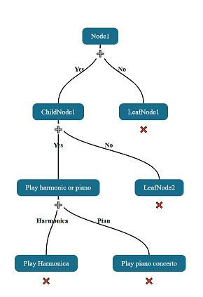

# decision-tree-visualizer 

NPM package that a visualize decision tree with add and delete actions

# Decision Tree Visualizer

A lightweight and interactive web component for visualizing decision trees. Nodes can be added or removed dynamically, and connections are automatically drawn with SVG. Ideal for embedding in any web page or integrating into frameworks like Angular.



## Features

- Visual representation of hierarchical decision trees
- Add and remove nodes dynamically
- Automatic curved SVG connectors with labels
- Shadow DOM encapsulated styling
- Framework-agnostic: works in plain HTML, Angular, React, Vue, etc.

## Installation

### Using Vite or other bundlers

```bash
npm install decision-tree-visualizer
```

Then import it in your main JavaScript/TypeScript file:
```js
import 'decision-tree-visualizer';
```

Or include directly in HTML:

```html
<script type="module" src="/path/to/decision-tree-visualizer.js"></script>
```

**_NOTE:_** Ensure the CSS file is bundled inline or imported correctly if using a bundler.

## Usage
### Basic HTML Example

```html
<!DOCTYPE html>
<html lang="en">
<head>
  <meta charset="UTF-8">
  <title>Decision Tree Example</title>
  
</head>
<body>

  <h1>Decision Tree</h1>
  <decision-tree-visualizer></decision-tree-visualizer>

  <script type="module">
      import '/dist/index.mjs';

      const el = document.querySelector('decision-tree-visualizer');
      el.treedata = {
        id: "root",
        label: "Start",
        children: [
          {
            id: "option1",
            label: "Option 1",
            edgeLabel: "Yes",
            children: [
              { id: "leaf1", label: "Leaf 1", edgeLabel: "Continue" }
            ]
          },
          {
            id: "option2",
            label: "Option 2",
            edgeLabel: "No"
          }
        ]
      };
  </script>

</body>
</html>
```

### Angular Example
In your Angular Application:

Firts install @angular/elements
```bash
npm install @angular/elements --save
```

Add in angular.json > projects > architect > build
```json
 "scripts": [
    "node_modules/decision-tree-visualizer/dist/index.mjs"
  ]
```

Add CUSTOM_ELEMENTS_SCHEMA to file module where the component is declared, id AppModule
prevents error in yout IDE or compiler
```ts
import { NgModule, CUSTOM_ELEMENTS_SCHEMA } from '@angular/core';
import { CommonModule } from '@angular/common';

@NgModule({
  declarations: [],
  imports: [CommonModule],
  schemas: [CUSTOM_ELEMENTS_SCHEMA] // <- HAS TO BE HERE
})
export class AppModule {}

```

Add TypeScript-support

Make a custom-elements.d.ts file in src map with this content
```ts
declare namespace JSX {
  interface IntrinsicElements {
    'decision-tree-visualizer': any;
  }
}

```
Change tsconfig.app.json file and add
```json
  "files": [
    "src/main.ts",
    "src/custom-elements.d.ts"
  ]
```

Use it in your component 
```ts
// app.component.ts
import { Component, AfterViewInit } from '@angular/core';

@Component({
  selector: 'app-root',
  template: `<decision-tree-visualizer></decision-tree-visualizer>`,
  standalone: true
})
export class AppComponent implements AfterViewInit {
  ngAfterViewInit() {
    const treeElement = document.querySelector('decision-tree-visualizer') as any;
    treeElement.treedata = {
      id: 'root',
      label: 'Start',
      children: [
        { id: 'yes', label: 'Yes Path', edgeLabel: 'yes', children: [] },
        { id: 'no', label: 'No Path', edgeLabel: 'no' }
      ]
    };
  }
}
```
**_NOTE:_** Make sure to import the custom element once globally, for example in main.ts:

## Development
To run locally:

```bash
npm install
npx vite
```

## Build for production:

```bash
npx vite build
```
## API

### Element

`<decision-tree-visualizer>`

### Properties

| Property   | Type   | Description                                                                 |
|------------|--------|-----------------------------------------------------------------------------|
| `treedata` | Object | Root node of the tree. Must include `id`, `label`, and optional `children` and `edgeLabel`. |
|`promptCallback`|callback function|Set your own callback function for a custom prompt. See modal.html|
|`leafOnClickCallback`|callback function|Setting a callback function when clicked on leaf node|


### Node Object Shape

```ts
{
  id: string;
  label: string;
  edgeLabel?: string;
  children?: Node[];
}
```
**_NOTE:_** Leaf: exclude children attribute from node and include children attribute for creating a child

## License
MIT © [Wim Dedulle]
